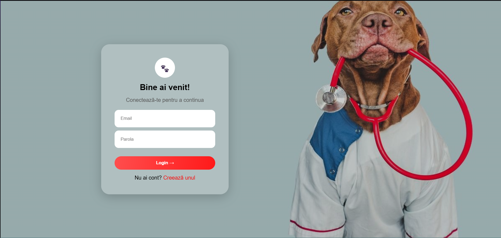
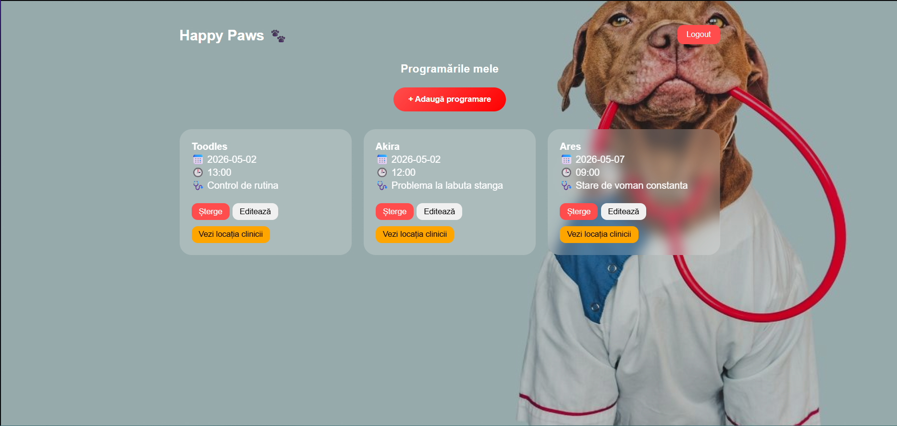
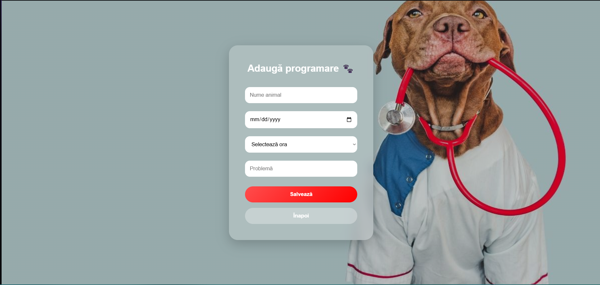
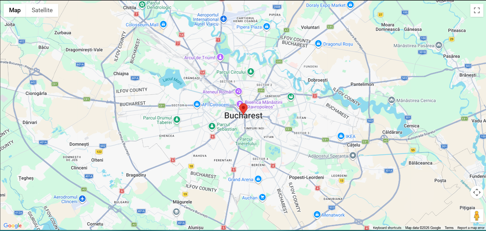

🌐 Aplicație live
🔗 https://happy-paws-vet.vercel.app

📦 Repository GitHub:
🔗 https://github.com/DanielaCotoi/HAPPY-PAWS-VET

Link you-YouTube: https://youtu.be/dBFv8MNzbAQ
1. Introducere
Aplicația Happy Paws Vet reprezintă o soluție web modernă pentru gestionarea programărilor într-o clinică veterinară. Aceasta permite utilizatorilor să interacționeze rapid și eficient cu serviciile clinicii, utilizând tehnologii cloud pentru stocarea datelor și automatizarea proceselor.
Aplicația este construită folosind o arhitectură bazată pe servicii cloud, ceea ce oferă scalabilitate, accesibilitate și ușurință în utilizare.

2. Descriere problemă
În cadrul clinicilor veterinare, gestionarea programărilor este adesea realizată manual sau prin sisteme neautomatizate, ceea ce poate duce la suprapuneri, erori sau dificultăți în comunicarea cu pacienții.
Problema abordată de această aplicație este digitalizarea și automatizarea procesului de programare, oferind o soluție eficientă care permite utilizatorilor să își gestioneze programările online, într-un mod sigur și organizat.

3. Descriere API
Aplicația utilizează servicii cloud care oferă API-uri REST pentru interacțiunea cu backend-ul:
Firebase Authentication API – pentru autentificarea utilizatorilor (login/register)
Cloud Firestore API – pentru stocarea și gestionarea datelor (programări)
EmailJS API – pentru trimiterea emailurilor de confirmare
Google Maps API – pentru afișarea locației clinicii
Aceste API-uri sunt integrate în aplicație prin metode specifice furnizate de fiecare serviciu.

4. Flux de date
🔄 Exemple de request / response
➤ Adăugare programare (Firestore)
Request:
{
  "userId": "12345",
  "petName": "Ares",
  "date": "2026-07-05",
  "time": "10:00",
  "problem": "Picior rupt"
}
Response:
{
  "id": "abc123",
  "status": "success"
}

➤ Trimitere email (EmailJS)
Request:
{
  "to_email": "user@gmail.com",
  "petName": "Ares",
  "date": "2026-07-05",
  "problem": "Picior rupt"
}
Response:
{
  "status": 200,
  "text": "OK"
}

🌐 Metode HTTP utilizate
POST → adăugare programare
GET → preluare programări
DELETE → ștergere programare
PUT / UPDATE → editare programare

🔐 Autentificare și autorizare
Aplicația utilizează Firebase Authentication, care permite autentificarea utilizatorilor prin email și parolă.
Accesul la date este controlat prin identificatorul utilizatorului (userId), astfel încât fiecare utilizator să își poată accesa doar propriile programări.

5. Capturi ecran aplicație 
## 🔐 Autentificare

## 🏠 Dashboard

## ➕ Programări

## 📍 Locație clinică

 
📍 Locație clinică
 
6. Referințe
https://firebase.google.com/docs
https://www.emailjs.com/docs/
https://developers.google.com/maps
https://vercel.com/docs
https://react.dev

✅ Concluzie
Aplicația Happy Paws Vet oferă o soluție modernă și eficientă pentru gestionarea programărilor într-o clinică veterinară, utilizând servicii cloud pentru stocare, autentificare și comunicare.
Integrarea mai multor API-uri externe demonstrează capacitatea aplicației de a funcționa într-un ecosistem distribuit și scalabil.
